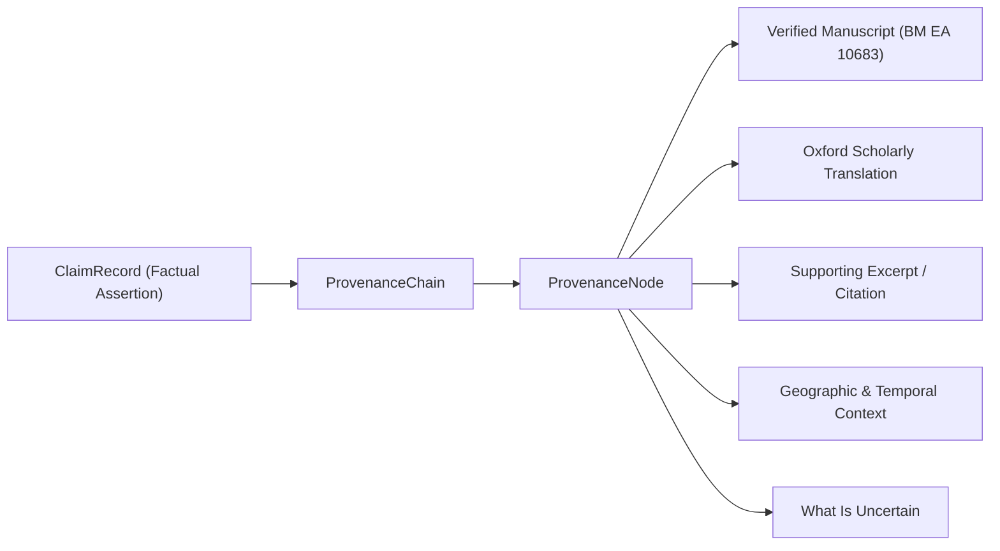

# Somnithos Provenance & Evidence Retrieval Engine

## 1. Core Epistemic Principles

Somnithos is designed from first principles as an **evidence-first, anti-hallucination dream exploration platform**. It strictly enforces the distinction between:

1. **Documented Evidence (World 1)**: Historical manuscripts, archaeological artifacts, peer-reviewed sleep research, and scholarly editions.
2. **Personal Interpretation (World 2)**: Cautious, non-dogmatic exploratory readings focused on personal reflection and open questions.
3. **Creative Imagination (World 2)**: Original poetic reflections and structured surrealist artwork prompts.

> [!IMPORTANT]
> **The Somnithos Invariant**: Large Language Models (LLMs like Gemini) must NEVER be treated as the source of historical, cultural, or scientific facts. If an empirical or historical claim cannot be verified against audited records, the system must explicitly state: `NO_RELIABLE_SOURCE`.

---

## 2. Source Quality Hierarchy

Somnithos classifies all cited sources into five strict tiers:

| Tier | Name | Description | Accepted for Factual Claims? |
| :--- | :--- | :--- | :--- |
| **`TIER_1`** | **Primary Historical Source** | Ancient manuscripts, hieratic papyri (*Papyrus Chester Beatty III*), cuneiform clay tablets (*Iškar Zaqīqu*), archaeological records, primary religious texts (*Brihadaranyaka Upanishad*). | **YES** |
| **`TIER_2`** | **Peer-Reviewed Academic Research** | Peer-reviewed cognitive neuroscience journals (*Nature Neuroscience*, *Behavioral and Brain Sciences*), university press critical translations (*Oxford Scholarly Editions*), academic monographs. | **YES** |
| **`TIER_3`** | **Institutional & Reference Archive** | Museum accession catalogs (British Museum), institutional repositories, academic dream research databases (*DreamResearch.net / UCSC*, *DreamBank*, *Sleep and Dream Database*). | **YES** |
| **`TIER_4`** | **Reputable Secondary Scholarship** | Peer-evaluated historiographies, academic commentaries, historical encyclopedias. | **YES** |
| **`TIER_5`** | **General Web Material** | Commercial websites, unverified popular blogs, generic "dream dictionaries". | **NO (Strictly Prohibited)** |

---

## 3. Evidence Levels

Every verified claim is tagged with an explicit epistemic certainty rating:

- **`HIGH`**: Replicated empirical findings in controlled polysomnography or fMRI sleep protocols (e.g. Walker & van der Helm 2009; Stickgold et al. 2001).
- **`MODERATE`**: Established, peer-reviewed theoretical models (e.g. Revonsuo Threat Simulation Theory 2000; Hobson Activation-Synthesis 1977).
- **`HISTORICAL`**: Directly documented ancient or medieval manuscripts (e.g. *Oneirocritica of Artemidorus*, *Babylonian Talmud Tractate Berakhot*).
- **`TRADITIONAL`**: Documented vernacular folklore and popular print almanacs (e.g. Ming-Qing *Zhougong Jiemeng* manuals).
- **`UNCERTAIN`**: Fragmentary texts, lacunae in cuneiform tablets, or disputed attributions.
- **`NO_RELIABLE_SOURCE`**: Returned when no verified scholarly source supports a given motif or claim.

---

## 4. Cultural Precision Standards

Somnithos prohibits pan-regional generalizations (e.g., *"Indian culture believes..."*, *"Native American traditions say..."*, *"African cultures hold..."*).

All cultural evidence records must specify:
1. **Exact Tradition**: (e.g. *Ramesside Scribal Oneirology*, *Antonine Greco-Roman Empirical Oneiromancy*).
2. **Community or School**: (e.g. *Deir el-Medina royal tomb artisan/scribal community*, *Daldis/Ephesus Divinatory School*).
3. **Geographic Boundaries**: (e.g. *Thebes, Upper Egypt*, *Ephesus & Western Asia Minor*).
4. **Historical Period**: (e.g. *New Kingdom, 19th Dynasty, c. 1275–1220 BCE*).
5. **Exact Supporting Passage**: Direct translated excerpt from the critical edition.
6. **Non-Universal Flag**: `isSymbolMeaningUniversal: false`.

---

## 5. Claim Verification & Provenance

Every claim presented to the user retains a complete provenance chain:



### Support Statuses:
- **`SUPPORTED`**: Backed by verified Tier 1 or Tier 2 sources with exact textual excerpts.
- **`PARTIALLY_SUPPORTED`**: Backed by secondary academic scholarship or institutional references without direct primary manuscript access.
- **`CONTESTED`**: Multiple credible sources document divergent, conflicting, or debating traditions (preserved side-by-side).
- **`INSUFFICIENT_EVIDENCE`**: Sources provided fail quality verification.
- **`NO_RELIABLE_SOURCE`**: No audited source exists in the catalog for this symbol.

---

## 6. What Constitutes `NO_RELIABLE_SOURCE`?

A motif triggers `NO_RELIABLE_SOURCE` whenever:
1. The symbol represents modern technology (e.g. *quantum submarine*, *particle collider*, *synthesizer*).
2. The motif is an abstract, obscure, or ungrounded dream element not present in verified historical manuscripts.
3. Online claims exist only on Tier 5 popular websites without primary manuscript citations.

When this occurs, Somnithos returns:
```json
{
  "status": "NO_RELIABLE_SOURCE",
  "explanation": "No sufficiently reliable source was found for this specific claim."
}
```
**Somnithos will NEVER fill an evidence gap with an AI-generated speculation.**

---

## 7. Difference Between Evidence and Interpretation

| Aspect | Documented Evidence (World 1) | Personal Interpretation (World 2) |
| :--- | :--- | :--- |
| **Nature** | Historical or empirical fact | Reflective, subjective inquiry |
| **Tone** | Scholarly, precise, bounded | Exploratory, open-ended, tentative |
| **Language** | *"In the 2nd-century CE Oneirocritica..."* | *"One possible reading...", "You might consider..."* |
| **Source** | Audited manuscripts & peer-reviewed journals | Original synthesis based on user's narrative |
| **Universal Claims?** | Strictly prohibited | Strictly prohibited |
| **Medical / Diagnostic?** | Strictly non-diagnostic | Strictly non-diagnostic |

---

## 8. Pluggable Search Adapter Architecture

The engine is decoupled through `EvidenceSearchProvider` and `EvidenceRetrieverService`. Future connectors can interface with:
- `AcademicSearchProvider` (e.g. JSTOR, OpenAlex, Semantic Scholar via server proxy)
- `InstitutionalSourceProvider` (e.g. British Museum Open API, Sefaria API)
- `ResearchDatabaseProvider` (e.g. UCSC DreamResearch, Sleep and Dream Database)

*All external API requests must execute on the backend server; no API keys or credentials may ever be embedded into client code.*
